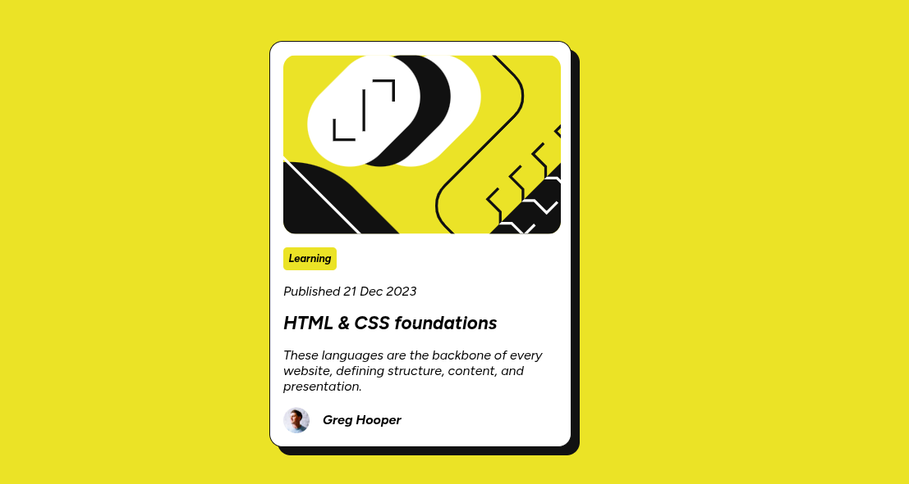

# Frontend Mentor - Blog preview card solution

This is a solution to the [Blog preview card challenge on Frontend Mentor](https://www.frontendmentor.io/challenges/blog-preview-card-ckPaj01IcS).  
Frontend Mentor challenges help you improve your coding skills by building realistic projects.

---

## Table of contents

- [Overview](#overview)
  - [Screenshot](#screenshot)
  - [Links](#links)
- [My process](#my-process)
  - [Built with](#built-with)
  - [What I learned](#what-i-learned)
  - [Continued development](#continued-development)
- [Author](#author)
- [Acknowledgments](#acknowledgments)

---

## Overview

### Screenshot

  

### Links

- Solution URL: [GitHub Repository](https://github.com/matondo11/blog-preview-card)  
- Live Site URL: [Live Demo](https://matondo11.github.io/blog-preview-card/)

---

## My process

### Built with

- Semantic **HTML5** markup
- **CSS custom properties** for colors and typography
- **Flexbox** for layout
- **Mobile-first workflow**

### What I learned

In this project, I improved my skills in:

- Centering and aligning elements using Flexbox
- Applying **responsive layouts** with media queries
- Using **CSS variables** for better maintainability
- Writing cleaner and more structured CSS

### Continued development

In future projects, I want to:

- Improve advanced responsive design techniques  
- Practice **CSS Grid** for more complex layouts  
- Learn and apply **accessibility best practices**  
- Focus on writing scalable and maintainable CSS code  

---

## Author

- Website – [Matondo Domingos Bunga](https://www.your-site.com)  
- Frontend Mentor – [@matondo11](https://www.frontendmentor.io/profile/matondo11)

---

## Acknowledgments

Thanks to the **Frontend Mentor community** for providing feedback and inspiration.  
Special thanks to documentation resources and tutorials that helped me reinforce my knowledge of CSS Flexbox and responsive design.
